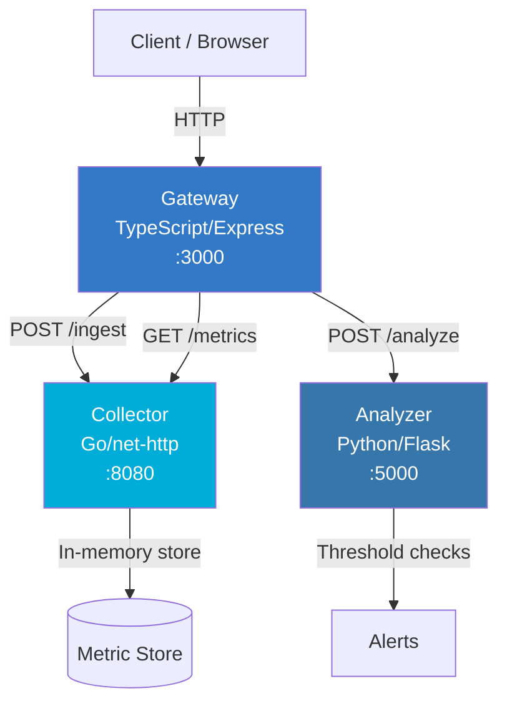

# PulseGuard

Real-time service health monitoring platform built with a polyglot microservice architecture (Python, Go, TypeScript).

PulseGuard collects, stores, and analyzes service metrics in real time. It detects anomalies by evaluating metrics against configurable thresholds and generates alerts when values exceed safe limits.

## Architecture



### Services

| Service | Language | Port | Description |
|---------|----------|------|-------------|
| **Gateway** | TypeScript (Express) | 3000 | API gateway — routes requests, aggregates service status |
| **Collector** | Go (net/http) | 8080 | High-performance metric ingestion and storage |
| **Analyzer** | Python (Flask) | 5000 | Statistical analysis and alert generation |

## Quick Start

### Prerequisites

- Docker & Docker Compose
- (For local dev) Go 1.22+, Python 3.11+, Node.js 20+

### Run with Docker Compose

```bash
cp .env.example .env
make up
```

All three services start with health checks. Verify:

```bash
curl http://localhost:3000/health   # Gateway
curl http://localhost:8080/health   # Collector
curl http://localhost:5000/health   # Analyzer
```

### Stop

```bash
make down
```

## API Specification

### Gateway (port 3000)

| Method | Endpoint | Description |
|--------|----------|-------------|
| GET | `/health` | Gateway health check |
| GET | `/api/status` | Aggregate status of all services |
| POST | `/api/ingest` | Proxy metric ingestion to Collector |
| POST | `/api/analyze` | Proxy metric analysis to Analyzer |
| GET | `/api/metrics?service=NAME` | Proxy metric retrieval from Collector |

### Collector (port 8080)

| Method | Endpoint | Description |
|--------|----------|-------------|
| GET | `/health` | Collector health check |
| POST | `/ingest` | Ingest metrics for a service |
| GET | `/metrics?service=NAME` | Retrieve stored metrics |

### Analyzer (port 5000)

| Method | Endpoint | Description |
|--------|----------|-------------|
| GET | `/health` | Analyzer health check |
| POST | `/analyze` | Analyze a list of metric values |

## Usage Examples

### Ingest metrics

```bash
curl -X POST http://localhost:3000/api/ingest \
  -H "Content-Type: application/json" \
  -d '{
    "service_name": "web-server",
    "metrics": [
      {"name": "cpu_usage", "value": 72.5},
      {"name": "memory_usage", "value": 85.3},
      {"name": "disk_io", "value": 45.0}
    ]
  }'
```

### Analyze metrics

```bash
curl -X POST http://localhost:3000/api/analyze \
  -H "Content-Type: application/json" \
  -d '{
    "metrics": [45.2, 67.8, 92.1, 55.0, 98.5]
  }'
```

Response includes statistical summary and alerts for values exceeding the threshold (default: 90.0).

### Retrieve metrics

```bash
curl http://localhost:3000/api/metrics?service=web-server
```

### Check all service statuses

```bash
curl http://localhost:3000/api/status
```

## Development

### Run tests

```bash
make test          # All tests
make test-python   # Python only
make test-go       # Go only
make test-ts       # TypeScript only
```

### Run linters

```bash
make lint
```

### Project structure

```
pulseguard/
├── docker-compose.yml
├── Makefile
├── .env.example
├── .gitignore
├── .github/workflows/ci.yml
├── services/
│   ├── analyzer/          # Python/Flask
│   │   ├── app.py
│   │   ├── requirements.txt
│   │   ├── Dockerfile
│   │   └── tests/
│   │       └── test_app.py
│   ├── collector/         # Go
│   │   ├── main.go
│   │   ├── main_test.go
│   │   ├── go.mod
│   │   └── Dockerfile
│   └── gateway/           # TypeScript/Express
│       ├── src/
│       │   ├── index.ts
│       │   └── index.test.ts
│       ├── package.json
│       ├── tsconfig.json
│       ├── jest.config.js
│       └── Dockerfile
└── README.md
```

## Configuration

All settings are configurable via environment variables (see `.env.example`):

| Variable | Default | Description |
|----------|---------|-------------|
| `GATEWAY_PORT` | 3000 | Gateway service port |
| `COLLECTOR_PORT` | 8080 | Collector service port |
| `ANALYZER_PORT` | 5000 | Analyzer service port |
| `ALERT_THRESHOLD` | 90.0 | Value threshold for generating alerts |
| `LOG_LEVEL` | INFO | Logging verbosity (DEBUG, INFO, WARNING, ERROR) |
| `COLLECTOR_URL` | http://localhost:8080 | Collector URL (used by Gateway) |
| `ANALYZER_URL` | http://localhost:5000 | Analyzer URL (used by Gateway) |

## CI/CD

GitHub Actions workflow (`.github/workflows/ci.yml`) runs on every push and PR to `main`:

1. **test-python** — Lint with flake8, test with pytest
2. **test-go** — Vet with go vet, test with go test
3. **test-typescript** — Lint with ESLint, test with Jest
4. **docker-build** — Build all Docker images (runs after tests pass)

> **Note**: `.github/workflows/ci.yml` may need to be manually added after initial repository setup due to GitHub API restrictions on the `.github/` directory.

## License

MIT
